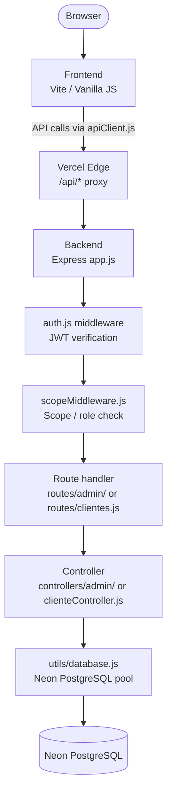

TANCAT System is a monorepo containing two independently deployed applications: a Node.js/Express REST API and a Vite-powered vanilla JS frontend. Both are hosted on Vercel in the São Paulo region (`gru1`) and share a single Neon PostgreSQL database.

## Repository structure

<Tree>
  <Tree.Folder name="tancat-system" defaultOpen>
    <Tree.File name="package.json" />
    <Tree.File name="start-tancat.js" />
    <Tree.File name="setup-project.js" />
    <Tree.File name="check-system.js" />
    <Tree.File name="vercel.json" />
    <Tree.Folder name="backend" defaultOpen>
      <Tree.File name="server.js" />
      <Tree.File name="app.js" />
      <Tree.Folder name="config">
        <Tree.File name="database.js" />
      </Tree.Folder>
      <Tree.Folder name="routes">
        <Tree.File name="clientes.js" />
        <Tree.File name="inventario.js" />
        <Tree.File name="inventarioJacintoRios.js" />
        <Tree.File name="inventarioRincon.js" />
        <Tree.Folder name="admin" />
      </Tree.Folder>
      <Tree.Folder name="controllers">
        <Tree.File name="clienteController.js" />
        <Tree.File name="inventarioController.js" />
        <Tree.Folder name="admin" />
      </Tree.Folder>
      <Tree.Folder name="middleware">
        <Tree.File name="auth.js" />
        <Tree.File name="scopeMiddleware.js" />
      </Tree.Folder>
      <Tree.Folder name="services">
        <Tree.File name="expirarReservas.js" />
        <Tree.File name="torneos-service.js" />
      </Tree.Folder>
      <Tree.Folder name="utils">
        <Tree.File name="database.js" />
      </Tree.Folder>
    </Tree.Folder>
    <Tree.Folder name="frontend" defaultOpen>
      <Tree.File name="index.html" />
      <Tree.Folder name="assets">
        <Tree.Folder name="js">
          <Tree.File name="apiClient.js" />
          <Tree.Folder name="auth">
            <Tree.File name="authFetch.js" />
            <Tree.File name="authGuard.js" />
          </Tree.Folder>
          <Tree.File name="cliente-main.js" />
          <Tree.Folder name="admin" />
        </Tree.Folder>
      </Tree.Folder>
      <Tree.Folder name="pages" />
    </Tree.Folder>
  </Tree.Folder>
</Tree>

## Request flow

The diagram below shows how a request from the browser reaches the database.

Public client routes skip the auth and scope middleware layers.

## Backend

### Entry point and middleware pipeline

The server boots in `server.js`, which imports and starts the Express application defined in `app.js`. The middleware pipeline in `app.js` applies security headers, CORS, JSON body parsing, and rate limiting before any route handler runs.

Route groups are mounted at their respective prefixes:

| Prefix | File | Description |
|---|---|---|
| `/api/cliente` | `routes/clientes.js` | Public-facing endpoints for the booking portal |
| `/api/admin` | `routes/admin/` | Admin-only endpoints, JWT-protected |
| `/api/inventario` | `routes/inventario.js` | Inventory for the main location |
| `/api/inventario/JacintoRios` | `routes/inventarioJacintoRios.js` | Inventory for Jacinto Ríos location |
| `/api/inventario/rincon` | `routes/inventarioRincon.js` | Inventory for Rincón location |
| `/api/health` | inline | Database connectivity check |

### Authentication and authorization

`middleware/auth.js` validates the JWT on every protected route. Tokens are issued at login with an 8-hour expiry and must be sent in the `Authorization: Bearer <token>` header.

`middleware/scopeMiddleware.js` enforces role-based access after the JWT is verified. Different admin roles have different scopes — for example, an inventory manager does not have access to payroll endpoints.

### Controllers and database access

Controllers contain all business logic. Each controller imports `utils/database.js` and executes parameterised SQL queries against the Neon connection pool. There is no ORM — queries are written directly in SQL.

Admin controllers live in `controllers/admin/` and mirror the route structure in `routes/admin/`. The public portal controller is `controllers/clienteController.js`.

### Background services

| Service | File | Purpose |
|---|---|---|
| Reservation expiry | `services/expirarReservas.js` | Automatically expires unconfirmed reservations after a timeout period |
| Tournament logic | `services/torneos-service.js` | Handles bracket generation and match scheduling |

## Frontend

### Public portal

The public client portal is a single-page experience built around `index.html` and `assets/js/cliente-main.js`. It allows visitors to browse locations, check court availability, and view active tournaments without authenticating.

### Admin panel

Each admin section is a separate HTML page in the `pages/` directory (e.g., `pages/reservas.html`, `pages/inventario.html`). Each page loads its own JavaScript module from `assets/js/admin/`, keeping bundles small and concerns separate.

`assets/js/authGuard.js` runs on every admin page load and redirects unauthenticated users to the login page before any content renders.

### API communication

All HTTP calls to the backend go through two layers:

- **`assets/js/apiClient.js`** — base request wrapper that sets the correct `Content-Type` headers and handles non-2xx responses.
- **`assets/js/auth/authFetch.js`** — wraps `apiClient.js` for authenticated requests, automatically attaching the stored JWT to the `Authorization` header.

## Database

TANCAT uses Neon PostgreSQL, a serverless Postgres platform. The connection pool is configured in `backend/config/database.js` with a maximum of 20 connections. SSL is required for all connections.

### Key tables

| Table | Description |
|---|---|
| `sedes` | The three sports complex locations |
| `deportes` | Sports offered at each location |
| `canchas` | Individual courts within each location |
| `turnos` | Available time slots per court |
| `clientes` | Registered customers |
| `empleados` | Staff members |
| `reservas` | Court bookings linking clients, courts, and slots |
| `productos` | Inventory items |
| `torneos` | Tournament definitions and scheduling |
| `proveedores` | Suppliers for inventory purchases |
| `compras` | Purchase orders |
| `ventas` | Point-of-sale transactions |

## Deployment

Both applications are deployed to Vercel. The `vercel.json` at the repository root configures a proxy rule: requests to `/api/*` are forwarded to the Express backend, and all other requests are served from the Vite-built frontend `dist/` directory.

See [Deployment](/configuration/deployment) for the full Vercel setup guide.
