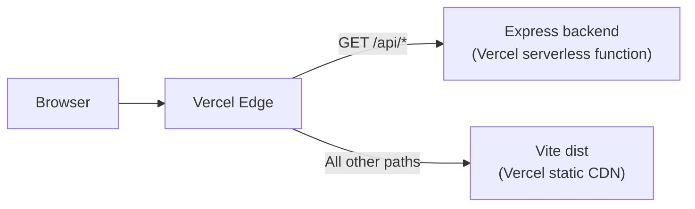

TANCAT System deploys to [Vercel](https://vercel.com) as a monorepo. The backend (Express) and frontend (Vite) are each configured as separate Vercel projects, and `vercel.json` in the repository root routes `/api/*` traffic to the Express backend while serving all other paths from the built frontend.

## How the proxy works

Vercel uses the `vercel.json` configuration to act as a reverse proxy in front of both applications:



This means the frontend and backend share the same domain in production, which avoids cross-origin issues for API calls made by the admin panel.

### vercel.json explained

```json vercel.json
{
  "rewrites": [
    {
      "source": "/api/:path*",
      "destination": "<backend-vercel-url>/api/:path*"
    }
  ]
}
```

- **`source`** matches any request path starting with `/api/`.
- **`destination`** forwards the request to the backend Vercel deployment URL, preserving the full path.
- All non-`/api` paths are served from the Vite build output in `frontend/dist/`.

<Note>
  The backend is deployed as a standard Node.js serverless function on Vercel. It receives the proxied request as if it came directly from the client.
</Note>

## Deployment steps

<Steps>
  <Step title="Install the Vercel CLI">
    ```bash
    npm i -g vercel
    ```
  </Step>

  <Step title="Deploy the backend">
    Navigate to the `backend/` directory and deploy:

    ```bash
    vercel --cwd backend
    ```

    When prompted:

    - **Set up and deploy**: Yes
    - **Project name**: `tancat-backend` (or your preferred name)
    - **Region**: `gru1` (São Paulo) — closest to Córdoba, Argentina

    After deployment, copy the production URL (e.g., `https://tancat-backend.vercel.app`). You will need it when configuring the frontend proxy.
  </Step>

  <Step title="Set backend environment variables">
    In the [Vercel dashboard](https://vercel.com/dashboard), open your backend project and go to **Settings → Environment Variables**. Add each variable for the **Production** environment:

    | Variable | Value |
    |---|---|
    | `DATABASE_URL` | Your Neon connection string with `sslmode=require` |
    | `NODE_ENV` | `production` |
    | `JWT_SECRET` | A long, randomly generated secret |
    | `JWT_EXPIRES_IN` | `8h` |
    | `CORS_ORIGIN` | Your frontend Vercel URL |
    | `RATE_LIMIT_WINDOW_MS` | `900000` |
    | `RATE_LIMIT_MAX_REQUESTS` | `100` |

    <Warning>
      Do not use the `.env` file for production secrets. Vercel injects environment variables at the platform level — no file needs to be present.
    </Warning>
  </Step>

  <Step title="Update vercel.json with the backend URL">
    Edit `vercel.json` in the repository root to point the `/api/*` rewrite destination to your deployed backend URL:

    ```json vercel.json
    {
      "rewrites": [
        {
          "source": "/api/:path*",
          "destination": "https://tancat-backend.vercel.app/api/:path*"
        }
      ]
    }
    ```
  </Step>

  <Step title="Deploy the frontend">
    From the repository root, deploy the frontend:

    ```bash
    vercel --cwd frontend
    ```

    When prompted:

    - **Project name**: `tancat-frontend`
    - **Build command**: `npm run build` (Vite builds to `dist/`)
    - **Output directory**: `dist`
    - **Region**: `gru1`

    The frontend does not require environment variables — all API calls go through the `/api/*` proxy defined in `vercel.json`.
  </Step>

  <Step title="Configure production CORS">
    After the frontend is deployed, copy its production URL (e.g., `https://tancat-frontend.vercel.app`) and update the `CORS_ORIGIN` environment variable on the **backend** Vercel project to match.

    Then redeploy the backend for the change to take effect:

    ```bash
    vercel --cwd backend --prod
    ```

    <Tip>
      If you use a custom domain (e.g., `tancat.com.ar`), add it to the Vercel project and include it in `CORS_ORIGIN` as well.
    </Tip>
  </Step>

  <Step title="Verify the production deployment">
    Check the backend health endpoint on your production domain:

    ```bash
    curl https://tancat-frontend.vercel.app/api/health
    ```

    A successful response confirms that the proxy is routing correctly and the backend is connected to Neon:

    ```json
    {
      "status": "ok",
      "database": "connected",
      "timestamp": "2026-03-19T12:00:00.000Z"
    }
    ```
  </Step>
</Steps>

## Production CORS configuration

CORS is enforced by the Express backend. The `CORS_ORIGIN` variable accepts a comma-separated list of allowed origins:

```env
# Single frontend domain
CORS_ORIGIN=https://tancat-frontend.vercel.app

# Multiple domains (custom domain + Vercel preview URL)
CORS_ORIGIN=https://tancat.com.ar,https://tancat-frontend.vercel.app
```

<Warning>
  Do not set `CORS_ORIGIN=*` in production. This would allow any website to make authenticated requests to the admin API.
</Warning>

## Continuous deployment

Connect your GitHub repository to both Vercel projects to enable automatic deployments on push:

1. In the Vercel dashboard, open the project.
2. Go to **Settings → Git** and connect the repository.
3. Set the **Root directory** to `backend/` or `frontend/` as appropriate.
4. Vercel will redeploy automatically when changes are pushed to the configured branch (typically `main`).

<Note>
  Preview deployments (for pull requests) inherit environment variables from the project settings. Make sure the `CORS_ORIGIN` on your backend includes the preview URLs if you want to test end-to-end flows in preview environments.
</Note>
